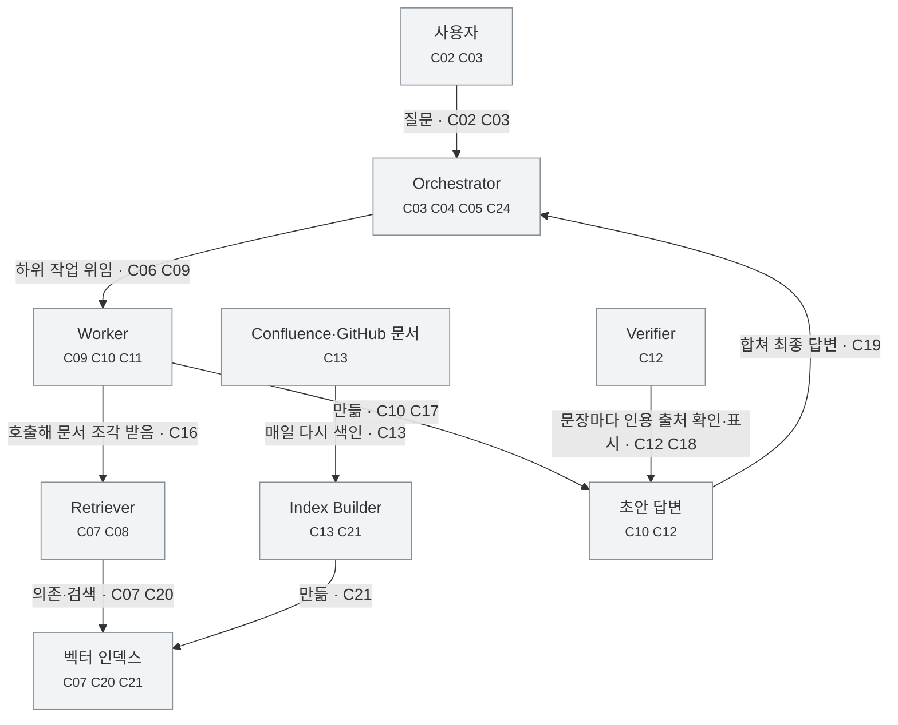

> 구조·참조 검사 통과. 의미 정확성・주장 누락・외부 사실의 참 여부를 보장하지 않음.

검토 상태: {"source_to_claim": "not-reviewed", "claim_to_narrative": "not-reviewed", "coverage": "not-reviewed", "reader_flow": "not-reviewed"}

작성자가 기록한 검토 상태이며 자동 의미 검증 결과가 아님 · 외부 확인 기록의 형식만 검사하며 실제 조회 수행·출처의 진위는 보장하지 않음

# Understanding Report — DocPilot 멀티 에이전트 아키텍처 설계 (v0.3 초안)

> 원문: `source.md` · 모드: `understand` · 생성: 2026-10-03
> 외부 검증: 수행하지 않음 — verified Claim 없음, confidence 기본값 unknown
> 최종 판정 기준은 아래의 **번호가 붙은 Claim 문장**이다. 그림과 표는 Claim을 찾아가는 길잡이일 뿐이다.
> 인터랙티브 뷰어: `viewer.html` — 읽기 페이지가 기본, 오른쪽 위 "검토 모드"에서 Claim 검색·필터·원문 대조

## 이 글은 무엇을 말하나

> **DocPilot은 사내 기술 문서를 읽고 질문에 답하는 멀티 에이전트 시스템이다. Orchestrator가 질문을 나눠 Worker에게 맡기고 결과를 합치며, 작성자는 Worker가 독립된 context를 쓰는 덕분에 Orchestrator의 context 사용량이 줄어든다고 말한다.<sup>[C01, C04, C05, C06, C25, C26]</sup>**

### DocPilot은 무엇인가

DocPilot은 사내 기술 문서를 읽고 질문에 답하는 멀티 에이전트 시스템이다.<sup>[C01]</sup> 멀티 에이전트 시스템은 여러 AI 에이전트가 일을 나눠 맡아 하나의 작업을 처리하는 구성을 말한다.<sup>[배경 K01]</sup> 사용자는 Slack 또는 웹 콘솔에서 질문을 보낸다.<sup>[C02]</sup>

### 어떤 부품으로 이루어져 있나

원문은 DocPilot을 이루는 구성 요소를 다음과 같이 설명한다.<sup>[C03, C07, C09, C12, C13]</sup>

- Orchestrator는 사용자 질문을 받아 작업을 나누고, 하위 작업을 Worker에게 맡긴 뒤 결과를 합친다.<sup>[C03, C04, C05, C06]</sup>
- Retriever는 벡터 인덱스에서 관련 문서 조각을 찾고, 한 번 검색할 때 최대 20개의 조각을 돌려준다.<sup>[C07, C08]</sup>
- Worker는 Orchestrator가 넘긴 하위 작업을 처리해 초안 답변을 만들고, 각자 독립된 context window를 쓴다.<sup>[C09, C10, C11]</sup>
- Verifier는 초안 답변의 문장마다 인용 출처가 있는지 확인한다.<sup>[C12]</sup>
- Index Builder는 매일 새벽 2시에 Confluence와 GitHub 문서를 다시 색인한다.<sup>[C13]</sup>

벡터 인덱스는 문서 조각을 의미를 담은 숫자 목록으로 바꿔 저장해 둔 검색용 저장소다.<sup>[배경 K02]</sup> context window는 언어 모델이 한 번에 읽고 참고할 수 있는 입력의 범위다.<sup>[배경 K03]</sup>

*구성 요소 사이의 위임·호출·데이터 흐름 (원문 2·3·4절)*



연결 근거 (그림을 못 읽어도 이 표로 검토할 수 있다):

| 출발 | 종류 | 라벨 | 도착 | 근거 |
|---|---|---|---|---|
| 사용자 | data-flow | 질문 | Orchestrator | C02, C03 |
| Orchestrator | delegation | 하위 작업 위임 | Worker | C06, C09 |
| Worker | dependency | 호출해 문서 조각 받음 | Retriever | C16 |
| Retriever | dependency | 의존·검색 | 벡터 인덱스 | C07, C20 |
| Index Builder | data-flow | 만듦 | 벡터 인덱스 | C21 |
| Confluence·GitHub 문서 | data-flow | 매일 다시 색인 | Index Builder | C13 |
| Worker | data-flow | 만듦 | 초안 답변 | C10, C17 |
| Verifier | association | 문장마다 인용 출처 확인·표시 | 초안 답변 | C12, C18 |
| 초안 답변 | data-flow | 합쳐 최종 답변 | Orchestrator | C19 |

### 질문 하나는 어떤 순서로 처리되나

원문은 요청 처리 순서를 번호 목록으로 적는다.<sup>[C14, C15, C16, C17, C18, C19]</sup> 사용자가 질문을 보내면 Orchestrator가 질문을 최대 4개의 하위 작업으로 나눈다.<sup>[C14, C15]</sup> 각 Worker는 Retriever를 불러 문서 조각을 받고 초안 답변을 만든다.<sup>[C16, C17]</sup> Verifier가 인용이 없는 문장을 표시하고, Orchestrator가 초안들을 합쳐 최종 답변을 보낸다.<sup>[C18, C19]</sup>

*원문 3절의 요청 처리 순서 (원문은 Worker를 executor라고도 부른다)*

1. 사용자가 질문을 보낸다. — C14
2. Orchestrator가 질문을 최대 4개의 하위 작업으로 나눈다. — C15
3. 각 Worker(원문: executor)가 Retriever를 호출해 문서 조각을 받는다. — C16
4. Worker(원문: executor)가 초안 답변을 만든다. — C17
5. Verifier가 인용이 없는 문장을 표시한다. — C18
6. Orchestrator가 초안들을 합쳐 최종 답변을 보낸다. — C19

### 데이터는 어디에서 오고 어디를 거치나

Retriever는 Index Builder가 만든 벡터 인덱스에 의존한다.<sup>[C20, C21]</sup> 원문에 따르면 인덱스가 갱신되지 않으면 Retriever는 최대 24시간 지난 문서를 돌려줄 수 있다.<sup>[C22 · ~불확실]</sup> Worker끼리는 직접 주고받지 않고, 모든 중간 결과는 Orchestrator를 거친다.<sup>[C23, C24]</sup>

### 작성자는 이 설계가 무엇을 얻는다고 보나

작성자는 Worker가 독립된 context를 쓰기 때문에 Orchestrator의 context 사용량이 줄어든다고 설명한다.<sup>[C11, C25, C26]</sup> 근거로 2025-08 내부 부하 테스트(질문 200개)에서 Orchestrator의 평균 입력 토큰이 단일 에이전트 구성보다 약 60% 줄었다고 보고한다.<sup>[C27]</sup> 토큰은 언어 모델이 텍스트를 나눠 처리하는 단위이고, 입력 토큰 수는 모델에 넣은 텍스트의 양을 나타낸다.<sup>[배경 K04]</sup>

작성자는 Verifier를 추가하면 환각 답변이 거의 사라질 것으로 예상한다.<sup>[C28 · ~불확실]</sup> 환각은 AI 모델이 근거 없는 내용을 사실처럼 만들어 내는 현상을 가리킨다.<sup>[배경 K05]</sup> 작성자는 또 이 구조를 대규모 조직에도 그대로 확장할 수 있다고 말한다.<sup>[C29]</sup>

### 아직 정하지 않은 것

- 질문 난이도에 따라 agent 수를 바꿀지는 아직 정하지 않았다.<sup>[C30]</sup>
- Verifier가 인용 출처의 내용까지 확인할지는 v0.4에서 결정한다.<sup>[C31]</sup>

#### 배경 설명 — 원문 밖 (CONTEXT · AI가 덧붙임 · 외부 확인 안 함)

- **K01 멀티 에이전트 시스템** — 여러 AI 에이전트가 일을 나눠 맡고 결과를 주고받으며 하나의 작업을 처리하는 구성이다.
- **K02 벡터 인덱스** — 문서 조각을 의미를 담은 숫자 목록(벡터)으로 바꿔 저장해 둔 검색용 저장소다. 질문과 의미가 가까운 조각을 찾는 데 쓴다.
- **K03 context window** — 언어 모델이 한 번에 읽고 참고할 수 있는 입력의 범위다. 여기에 들어간 내용만 모델이 답을 만들 때 쓴다.
- **K04 토큰** — 언어 모델이 텍스트를 나눠 처리하는 단위다. 입력 토큰 수는 모델에 넣은 텍스트의 양을 나타낸다.
- **K05 환각** — AI 모델이 근거 없는 내용을 사실처럼 만들어 내는 현상을 가리킨다.

<sub>문장 끝 [C..]는 근거 Claim, [배경 K..]는 원문 밖 설명. ⚠출처 필요·~불확실·~추론·의견 표시는 근거 중 가장 약한 상태.</sub>

---

# 검토

## 1. 한눈에 보기

| 항목 | 개수 | 뜻 |
|---|---|---|
| 총 Claim | 31 | 원문에서 뽑은 주장 단위 |
| 근거 제시됨 | 2 | verified(외부 확인) + supported(원문이 출처·데이터를 제시 — 출처 내용 자체는 미확인) |
| 출처 확인 필요 | 0 | 확인 가능한 사실·통계인데 출처 없음 |
| 작성자 단언 | 27 | 원문이 그렇게 말할 뿐 근거는 없음 (설계 결정·일반론 포함) |
| Inference | 0 | 원문 속 추론 0 + 이 리포트가 덧붙인 해석 0 |
| 의견·평가 | 0 | 가치 판단·권고 |
| 불확실 | 2 | 원문 스스로 유보 |
| 충돌 가능성 | 0 | 다른 Claim 또는 외부 확인과 양립 불가 |

유형 분포: `fact` 11, `relationship` 10, `procedure` 6, `quantitative` 3, `temporal` 2, `conditional` 2, `uncertain` 2, `causal` 2, `prediction` 2, `definition` 1, `comparison` 1

### 요약 (문장마다 근거 Claim과 가장 약한 근거 상태 표시)

- DocPilot은 사내 기술 문서를 읽고 질문에 답하는 멀티 에이전트 시스템이다. — C01 **[작성자 단언]**
- Orchestrator가 질문을 최대 4개의 하위 작업으로 나눠 Worker에게 위임하고, Worker가 Retriever로 문서 조각을 받아 초안 답변을 만든다. — C06, C15, C16, C17 **[작성자 단언]**
- Verifier는 인용이 없는 문장을 표시하지만, 인용 출처의 내용까지 확인하는지는 v0.4에서 결정한다. — C12, C18, C31 **[작성자 단언]**
- Retriever는 Index Builder가 매일 다시 만드는 벡터 인덱스에 의존하고, 인덱스가 갱신되지 않으면 최대 24시간 지난 문서를 반환할 수 있다. — C13, C20, C21, C22 **[불확실]**
- 원문은 Worker의 독립된 context가 Orchestrator의 context 사용량을 줄인다고 말하고, 내부 측정에서 평균 입력 토큰이 단일 에이전트 구성 대비 약 60% 감소했다고 보고한다. — C26, C27 **[작성자 단언 · 근거 약함]**
- 원문은 Verifier를 추가하면 환각 답변이 거의 사라질 것으로 예상하고, 이 구조가 대규모 조직에도 그대로 확장할 수 있다고 말한다. — C28, C29 **[불확실]**

## 2. 먼저 확인해야 할 Claim

```text
REVIEW FIRST

C28 — 불확실 · 근거 없는 인과 · 모호한 표현 · 조건 누락 · 위험 높음
C29 — 작성자 단언 · 근거 없는 강한 단정 · 지나친 일반화 · 위험 높음
C22 — 불확실 · 조건 누락
C24 — 작성자 단언 · 모호한 표현
C26 — 작성자 단언 · 근거 없는 인과
C16 — 작성자 단언 · 이름 불일치
C17 — 작성자 단언 · 이름 불일치
C30 — 작성자 단언 · 이름 불일치
```

- **C28** Verifier를 추가하면 환각 답변이 거의 사라질 것으로 작성자는 예상한다.  
  `prediction/causal/conditional/uncertain` · **[불확실]** · confidence `unknown` · P23 (36행, §5. 설계 판단)  
  조건: Verifier를 추가할 때  
  ⚑ '거의'의 기준이 없다. Verifier는 인용 출처가 있는지만 확인하고(C12) 없는 문장을 표시만 하며(C18), 출처 내용 확인 여부는 미정(C31)이다 — 인용이 붙은 환각 문장을 어떻게 막는지 원문에 없다.
- **C29** DocPilot 구조는 대규모 조직에도 그대로 확장할 수 있다.  
  `prediction` · **[작성자 단언]** · confidence `unknown` · P23 (36행, §5. 설계 판단)  
  ⚑ '그대로 확장'을 뒷받침하는 측정·조건(문서 규모, 사용자 수, Worker 상한 4개와의 관계)이 원문에 없다.
- **C22** 벡터 인덱스가 갱신되지 않으면 Retriever는 최대 24시간 지난 문서를 반환할 수 있다.  
  `conditional/uncertain` · **[불확실]** · confidence `unknown` · P19 (28행, §4. 데이터 흐름과 의존성)  
  조건: 벡터 인덱스가 갱신되지 않을 때  
  ⚑ '갱신되지 않으면'과 '최대 24시간'은 매일 1회 색인(C13)이 정상일 때만 함께 성립한다. 색인이 실패해 갱신이 이어서 빠지면 24시간을 넘을 수 있다 — 원문 의도 확인 필요.
- **C24** 모든 중간 결과는 Orchestrator를 거친다.  
  `relationship` · **[작성자 단언]** · confidence `unknown` · P20 (30행, §4. 데이터 흐름과 의존성)  
  ⚑ '중간 결과'의 범위가 정의되지 않았다. 3단계(C16)에서 Worker는 Retriever에게서 문서 조각을 직접 받고, Verifier(C18)가 초안을 어떤 경로로 받는지도 원문에 없다.
- **C26** Worker의 독립된 context 사용이 Orchestrator의 context 사용량 감소의 원인이다.  
  `causal` · **[작성자 단언]** · confidence `unknown` · P22 (34행, §5. 설계 판단)  
  ⚑ 원문의 측정(C27)은 단일 에이전트 구성 대비 감소만 보여 준다. 감소의 원인이 '독립된 context'인지는 측정이 따로 분리하지 않았다.
- **C16** 각 Worker는 Retriever를 호출해 문서 조각을 받는다.  
  `procedure/relationship` · **[작성자 단언]** · confidence `unknown` · P14 (21행, §3. 요청 처리 흐름)  
  ⚑ 원문 3절은 Worker를 executor로 부른다. 하위 작업 처리·초안 답변 생성이 P08의 Worker 설명과 같아 같은 구성요소(E04)로 묶었지만, 원문이 둘이 같다고 명시하지는 않는다.
- **C17** Worker는 초안 답변을 만든다.  
  `procedure` · **[작성자 단언]** · confidence `unknown` · P15 (22행, §3. 요청 처리 흐름)  
  ⚑ 원문 3절은 Worker를 executor로 부른다. 하위 작업 처리·초안 답변 생성이 P08의 Worker 설명과 같아 같은 구성요소(E04)로 묶었지만, 원문이 둘이 같다고 명시하지는 않는다.
- **C30** agent 수를 질문 난이도에 따라 바꿀지는 아직 정하지 않았다.  
  `fact` · **[작성자 단언]** · confidence `unknown` · P25 (40행, §6. 미정 사항)  
  ⚑ 'agent'가 Worker(executor)만 가리키는지 Orchestrator·Retriever·Verifier까지 포함하는지 원문에서 확정되지 않아 entity로 묶지 않았다. C15의 '최대 4개 하위 작업'과의 관계도 불명.

## 3. 핵심 Claim

- **C01** DocPilot은 사내 기술 문서를 읽고 질문에 답하는 멀티 에이전트 시스템이다.  
  `definition` · **[작성자 단언]** · confidence `unknown` · P04 (7행, §1. 개요)
- **C06** Orchestrator는 하위 작업을 Worker에게 위임한다.  
  `relationship` · **[작성자 단언]** · confidence `unknown` · P06 (11행, §2. 구성 요소)
- **C11** Worker는 독립된 context window를 사용한다.  
  `fact` · **[작성자 단언]** · confidence `unknown` · P08 (13행, §2. 구성 요소)
- **C15** Orchestrator는 질문을 최대 4개의 하위 작업으로 나눈다.  
  `procedure/quantitative` · **[작성자 단언]** · confidence `unknown` · P13 (20행, §3. 요청 처리 흐름)
- **C20** Retriever는 Index Builder가 만든 벡터 인덱스에 의존한다.  
  `relationship` · **[작성자 단언]** · confidence `unknown` · P19 (28행, §4. 데이터 흐름과 의존성)
- **C24** 모든 중간 결과는 Orchestrator를 거친다.  
  `relationship` · **[작성자 단언]** · confidence `unknown` · P20 (30행, §4. 데이터 흐름과 의존성)
- **C26** Worker의 독립된 context 사용이 Orchestrator의 context 사용량 감소의 원인이다.  
  `causal` · **[작성자 단언]** · confidence `unknown` · P22 (34행, §5. 설계 판단)
- **C27** 2025-08 내부 부하 테스트(질문 200개)에서 Orchestrator의 평균 입력 토큰은 단일 에이전트 구성 대비 약 60% 감소했다.  
  `quantitative/comparison` · **[출처·데이터 제시됨]** · confidence `low` · P22 (34행, §5. 설계 판단)
- **C28** Verifier를 추가하면 환각 답변이 거의 사라질 것으로 작성자는 예상한다.  
  `prediction/causal/conditional/uncertain` · **[불확실]** · confidence `unknown` · P23 (36행, §5. 설계 판단)  
  조건: Verifier를 추가할 때
- **C29** DocPilot 구조는 대규모 조직에도 그대로 확장할 수 있다.  
  `prediction` · **[작성자 단언]** · confidence `unknown` · P23 (36행, §5. 설계 판단)

## 4. 관계 구조

### V01 · 구성 요소와 데이터 흐름


연결 근거 (그림을 못 읽어도 이 표로 검토할 수 있다):

| 출발 | 종류 | 라벨 | 도착 | 근거 |
|---|---|---|---|---|
| 사용자 | data-flow | 질문 | Orchestrator | C02, C03 |
| Orchestrator | delegation | 하위 작업 위임 | Worker | C06, C09 |
| Worker | dependency | 호출해 문서 조각 받음 | Retriever | C16 |
| Retriever | dependency | 의존·검색 | 벡터 인덱스 | C07, C20 |
| Index Builder | data-flow | 만듦 | 벡터 인덱스 | C21 |
| Confluence·GitHub 문서 | data-flow | 매일 다시 색인 | Index Builder | C13 |
| Worker | data-flow | 만듦 | 초안 답변 | C10, C17 |
| Verifier | association | 문장마다 인용 출처 확인·표시 | 초안 답변 | C12, C18 |
| 초안 답변 | data-flow | 합쳐 최종 답변 | Orchestrator | C19 |

### V02 · 요청 처리 흐름 (원문 3절 번호 목록)

1. 사용자가 질문을 보낸다. — C14
2. Orchestrator가 질문을 최대 4개의 하위 작업으로 나눈다. — C15
3. 각 Worker(원문: executor)가 Retriever를 호출해 문서 조각을 받는다. — C16
4. Worker(원문: executor)가 초안 답변을 만든다. — C17
5. Verifier가 인용이 없는 문장을 표시한다. — C18
6. Orchestrator가 초안들을 합쳐 최종 답변을 보낸다. — C19

## 5. 비교 / 예외

_비교·예외 표 없음._

### 애니메이션 후보

_애니메이션 후보 없음 — 정적 표현으로 충분하다._

## 6. AI가 추론한 부분

**원문 작성자가 스스로 끌어낸 추론**

_없음_

**이 리포트가 덧붙인 해석 (원문에 없음 — 점선으로 표시)**

_없음_

## 7. 원문 추적

| 원문 단위 | 행 | 섹션 | Claim |
|---|---|---|---|
| P02 | 3–3 | DocPilot 멀티 에이전트 아키텍처 설계 (v0.3 초안) | _skip: 문서 성격 안내(테스트 케이스 A·가상 시스템 예시) — DocPilot에 대한 주장 아님_ |
| P04 | 7–7 | 1. 개요 | C01, C02 |
| P06 | 11–11 | 2. 구성 요소 | C03, C04, C05, C06 |
| P07 | 12–12 | 2. 구성 요소 | C07, C08 |
| P08 | 13–13 | 2. 구성 요소 | C09, C10, C11 |
| P09 | 14–14 | 2. 구성 요소 | C12 |
| P10 | 15–15 | 2. 구성 요소 | C13 |
| P12 | 19–19 | 3. 요청 처리 흐름 | C14 |
| P13 | 20–20 | 3. 요청 처리 흐름 | C15 |
| P14 | 21–21 | 3. 요청 처리 흐름 | C16 |
| P15 | 22–22 | 3. 요청 처리 흐름 | C17 |
| P16 | 23–23 | 3. 요청 처리 흐름 | C18 |
| P17 | 24–24 | 3. 요청 처리 흐름 | C19 |
| P19 | 28–28 | 4. 데이터 흐름과 의존성 | C20, C21, C22 |
| P20 | 30–30 | 4. 데이터 흐름과 의존성 | C23, C24 |
| P22 | 34–34 | 5. 설계 판단 | C25, C26, C27 |
| P23 | 36–36 | 5. 설계 판단 | C28, C29 |
| P25 | 40–40 | 6. 미정 사항 | C30 |
| P26 | 41–41 | 6. 미정 사항 | C31 |

---

## 부록 A. 전체 Claim (31개)

- **C01** DocPilot은 사내 기술 문서를 읽고 질문에 답하는 멀티 에이전트 시스템이다.  
  `definition` · **[작성자 단언]** · confidence `unknown`
- **C02** 사용자는 Slack 또는 웹 콘솔에서 질문을 보낸다.  
  `fact` · **[작성자 단언]** · confidence `unknown`
- **C03** Orchestrator는 사용자 질문을 받는다.  
  `fact/relationship` · **[작성자 단언]** · confidence `unknown`
- **C04** Orchestrator는 작업을 나눈다.  
  `fact` · **[작성자 단언]** · confidence `unknown`
- **C05** Orchestrator는 결과를 합친다.  
  `fact` · **[작성자 단언]** · confidence `unknown`
- **C06** Orchestrator는 하위 작업을 Worker에게 위임한다.  
  `relationship` · **[작성자 단언]** · confidence `unknown`
- **C07** Retriever는 벡터 인덱스에서 관련 문서 조각을 찾는다.  
  `fact/relationship` · **[작성자 단언]** · confidence `unknown`
- **C08** Retriever는 한 번의 검색에서 최대 20개의 조각을 반환한다.  
  `quantitative` · **[작성자 단언]** · confidence `unknown`
- **C09** Worker는 Orchestrator가 넘긴 하위 작업을 처리한다.  
  `relationship` · **[작성자 단언]** · confidence `unknown`
- **C10** Worker는 초안 답변을 만든다.  
  `fact` · **[작성자 단언]** · confidence `unknown`
- **C11** Worker는 독립된 context window를 사용한다.  
  `fact` · **[작성자 단언]** · confidence `unknown`
- **C12** Verifier는 초안 답변의 문장마다 인용 출처가 있는지 확인한다.  
  `fact` · **[작성자 단언]** · confidence `unknown`
- **C13** Index Builder는 매일 새벽 2시에 Confluence와 GitHub 문서를 다시 색인한다.  
  `fact/temporal/relationship` · **[작성자 단언]** · confidence `unknown`
- **C14** 사용자는 질문을 보낸다.  
  `procedure` · **[작성자 단언]** · confidence `unknown`
- **C15** Orchestrator는 질문을 최대 4개의 하위 작업으로 나눈다.  
  `procedure/quantitative` · **[작성자 단언]** · confidence `unknown`
- **C16** 각 Worker는 Retriever를 호출해 문서 조각을 받는다.  
  `procedure/relationship` · **[작성자 단언]** · confidence `unknown`
- **C17** Worker는 초안 답변을 만든다.  
  `procedure` · **[작성자 단언]** · confidence `unknown`
- **C18** Verifier는 인용이 없는 문장을 표시한다.  
  `procedure` · **[작성자 단언]** · confidence `unknown`
- **C19** Orchestrator는 초안들을 합쳐 최종 답변을 보낸다.  
  `procedure` · **[작성자 단언]** · confidence `unknown`
- **C20** Retriever는 Index Builder가 만든 벡터 인덱스에 의존한다.  
  `relationship` · **[작성자 단언]** · confidence `unknown`
- **C21** Index Builder는 벡터 인덱스를 만든다.  
  `relationship` · **[작성자 단언]** · confidence `unknown`
- **C22** 벡터 인덱스가 갱신되지 않으면 Retriever는 최대 24시간 지난 문서를 반환할 수 있다.  
  `conditional/uncertain` · **[불확실]** · confidence `unknown`  
  조건: 벡터 인덱스가 갱신되지 않을 때
- **C23** Worker 사이에는 직접 통신이 없다.  
  `relationship` · **[작성자 단언]** · confidence `unknown`
- **C24** 모든 중간 결과는 Orchestrator를 거친다.  
  `relationship` · **[작성자 단언]** · confidence `unknown`
- **C25** Orchestrator의 context 사용량이 줄어든다.  
  `fact` · **[출처·데이터 제시됨]** · confidence `low`
- **C26** Worker의 독립된 context 사용이 Orchestrator의 context 사용량 감소의 원인이다.  
  `causal` · **[작성자 단언]** · confidence `unknown`
- **C27** 2025-08 내부 부하 테스트(질문 200개)에서 Orchestrator의 평균 입력 토큰은 단일 에이전트 구성 대비 약 60% 감소했다.  
  `quantitative/comparison` · **[출처·데이터 제시됨]** · confidence `low`
- **C28** Verifier를 추가하면 환각 답변이 거의 사라질 것으로 작성자는 예상한다.  
  `prediction/causal/conditional/uncertain` · **[불확실]** · confidence `unknown`  
  조건: Verifier를 추가할 때
- **C29** DocPilot 구조는 대규모 조직에도 그대로 확장할 수 있다.  
  `prediction` · **[작성자 단언]** · confidence `unknown`
- **C30** agent 수를 질문 난이도에 따라 바꿀지는 아직 정하지 않았다.  
  `fact` · **[작성자 단언]** · confidence `unknown`
- **C31** Verifier가 인용 출처의 내용까지 확인하는지는 v0.4에서 결정한다.  
  `temporal` · **[작성자 단언]** · confidence `unknown`

## 부록 B. Traceability 검증

| Gate | 판정 | 내용 |
|---|---|---|
| G1 | PASS | 모든 핵심 주장에 Claim ID |
| G2 | PASS | 시각 요소 ↔ Claim 연결 |
| G3 | PASS | 원문에 없는 사실 생성 없음 |
| G4 | PASS | Fact / Inference 구분 |
| G5 | PASS | 불확실성 표시 |
| G6 | PASS | 원문으로 돌아갈 수 있음 |

남은 경고 (Gate를 막지 않지만 사람이 판단할 것):

- `G1` explanation_plan: 독자 중심 설명 기획이 없다. 기존 IR 호환을 위해 경고로 표시한다
