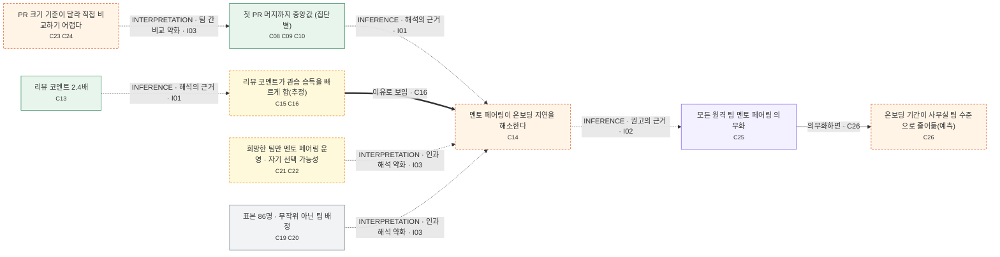

> ASD-STE100 참고 작성 · 공식 준수 미검증
> 구조·참조 검사 통과. 의미 정확성・주장 누락・외부 사실의 참 여부를 보장하지 않음.

검토 상태: {"source_to_claim": "not-reviewed", "claim_to_narrative": "not-reviewed", "coverage": "not-reviewed", "reader_flow": "not-reviewed"}

작성자가 기록한 검토 상태이며 자동 의미 검증 결과가 아님 · 외부 확인 기록의 형식만 검사하며 실제 조회 수행·출처의 진위는 보장하지 않음

# Understanding Report — 원격 근무와 신입 개발자 온보딩 기간: 사내 조사 보고서

> 원문: `source.md` · 모드: `understand` · 생성: 2026-10-03
> 외부 검증: 수행하지 않음 — verified Claim 없음, confidence 기본값 unknown
> 최종 판정 기준은 아래의 **번호가 붙은 Claim 문장**이다. 그림과 표는 Claim을 찾아가는 길잡이일 뿐이다.
> 인터랙티브 뷰어: `viewer.html` — 읽기 페이지가 기본, 오른쪽 위 "검토 모드"에서 Claim 검색·필터·원문 대조

## 이 글은 무엇을 말하나

> **이 사내 조사 보고서는 원격 팀 신입 개발자가 사무실 팀보다 첫 PR 머지까지 더 오래 걸렸지만, 멘토 페어링을 운영한 원격 팀에서는 그 차이가 거의 없었다고 보고한다. 작성자는 모든 원격 팀에 멘토 페어링을 의무화해야 한다고 권고한다.<sup>[C02, C03, C25 · 의견]</sup>**

### 무엇을, 어떻게 조사했나

보고서는 스스로 가상의 회사 데이터를 쓴 예시 문서이며, 수치는 실제 통계가 아니라고 밝힌다.<sup>[C01]</sup> 조사는 2024년 3월부터 2025년 2월까지 입사한 신입 개발자 86명의 저장소 기록을 분석했다.<sup>[C04]</sup> 이 가운데 원격 팀 소속이 47명, 사무실 팀 소속이 39명이다.<sup>[C05, C06]</sup> 온보딩 기간을 나타내는 대리 지표로는 첫 PR 머지까지 걸린 영업일 수를 썼다.<sup>[C07]</sup> PR(풀 리퀘스트)은 개발자가 만든 코드 변경을 공용 저장소에 합쳐 달라고 요청하는 단위이고, 머지는 그 변경이 실제로 합쳐지는 것을 뜻한다.<sup>[배경 K01]</sup> 대리 지표란 직접 재기 어려운 대상을 대신해 재는, 그 대상과 관련된 다른 값을 말한다.<sup>[배경 K02]</sup>

### 원격 팀은 얼마나 더 오래 걸렸나

보고서의 핵심 결과는 원격 팀 신입 개발자가 사무실 팀보다 첫 PR 머지까지 더 오래 걸렸다는 것이다.<sup>[C02]</sup> 중앙값으로 보면 사무실 팀은 6영업일, 원격 팀 전체는 9영업일로, 원격 팀이 3영업일 길었다.<sup>[C08, C11, C12]</sup> 중앙값은 값을 크기 순서로 늘어놓았을 때 한가운데에 오는 값으로, 극단적인 값의 영향을 덜 받는다.<sup>[배경 K03]</sup> 원격 팀을 멘토 페어링 여부로 나누면 멘토 페어링 없는 원격 팀은 11영업일, 멘토 페어링 원격 팀은 7영업일이었다.<sup>[C09, C10]</sup> 보고서는 멘토 페어링 원격 팀과 사무실 팀 사이에는 차이가 거의 없었다고 요약한다.<sup>[C03]</sup> 멘토 페어링은 흔히 신입을 경험 있는 동료(멘토)와 짝지어 함께 일하게 하는 방식을 가리킨다.<sup>[배경 K04]</sup>

*보고서가 제시한 집단별 인원과 첫 PR 머지까지 중앙값*

| 집단 | 인원(명) | 첫 PR 머지 중앙값(영업일) | 원문 위치 | Claim | 근거 상태 |
|---|---|---|---|---|---|
| 사무실 팀 | 39 | 6 | 결과 표 P09 | C08, C06 | 작성자 단언 |
| 원격 팀(멘토 페어링 없음) | 28 | 11 | 결과 표 P10 | C09 | 출처·데이터 제시됨 |
| 원격 팀(멘토 페어링 있음) | 19 | 7 | 결과 표 P11 | C10 | 출처·데이터 제시됨 |
| 원격 팀 전체 | 47 | 9 | 방법 P06 · 본문 P12 | C05, C11 | 작성자 단언 |

또 멘토 페어링 팀의 신입 개발자는 첫 달에 코드 리뷰 코멘트를 평균 2.4배 더 많이 받았다고 보고서는 적는다(리뷰 시스템 로그 기준).<sup>[C13]</sup>

### 작성자는 이 결과를 어떻게 해석하나

작성자는 멘토 페어링이 원격 근무의 온보딩 지연을 해소한다고 해석한다.<sup>[C14 · ~추론]</sup> 그 이유는 리뷰 코멘트가 많을수록 신입 개발자가 코드베이스의 관습을 빨리 익히기 때문으로 보인다고 추정한다.<sup>[C15, C16 · ~불확실]</sup> 작성자는 외부 연구도 비슷한 경향을 보고한다고 덧붙인다.<sup>[C17 · ⚠출처 필요]</sup> 예로 드는 것은 GitLab의 2023 원격 근무 보고서로, 이 보고서가 원격 신입의 생산성 도달 시간이 더 길다고 밝혔다는 것이다.<sup>[C18 · ⚠출처 필요]</sup> GitLab은 코드 저장소와 개발 협업 도구를 제공하는 소프트웨어 회사다.<sup>[배경 K05]</sup>

### 보고서가 스스로 밝힌 한계

- 작성자는 표본이 86명으로 작다고 적는다.<sup>[C19 · 의견]</sup>
- 팀 배정은 무작위가 아니었다.<sup>[C20]</sup>
- 멘토 페어링은 희망한 팀만 운영했다. 작성자는 그 팀들이 원래 온보딩에 관심이 많은 팀이었을 가능성이 있다고 적는다.<sup>[C21, C22 · ~불확실]</sup>
- 보고서는 팀마다 PR 크기 기준이 달라서 첫 PR 머지 시점을 팀 간에 직접 비교하기 어렵다고 적는다.<sup>[C23, C24 · ~추론]</sup>

### 작성자는 무엇을 하자고 하나

작성자는 모든 원격 팀에 멘토 페어링을 의무화해야 한다고 권고한다.<sup>[C25 · 의견]</sup> 그렇게 하면 원격 팀의 온보딩 기간이 사무실 팀 수준으로 줄어들 것이라고 작성자는 예측한다.<sup>[C26 · ~추론]</sup>

*결과에서 해석·권고로 이어지는 흐름과 원문 한계가 걸리는 지점 (점선은 원문에 없는 연결)*



연결 근거 (그림을 못 읽어도 이 표로 검토할 수 있다):

| 출발 | 종류 | 라벨 | 도착 | 근거 |
|---|---|---|---|---|
| 첫 PR 머지까지 중앙값 (집단별) | association | 해석의 근거 | 멘토 페어링이 온보딩 지연을 해소한다 | **INFERENCE** I01 |
| 리뷰 코멘트 2.4배 | association | 해석의 근거 | 리뷰 코멘트가 관습 습득을 빠르게 함(추정) | **INFERENCE** I01 |
| 리뷰 코멘트가 관습 습득을 빠르게 함(추정) | causal | 이유로 보임 | 멘토 페어링이 온보딩 지연을 해소한다 | C16 |
| 멘토 페어링이 온보딩 지연을 해소한다 | association | 권고의 근거 | 모든 원격 팀 멘토 페어링 의무화 | **INFERENCE** I02 |
| 모든 원격 팀 멘토 페어링 의무화 | conditional | 의무화하면 | 온보딩 기간이 사무실 팀 수준으로 줄어듦(예측) | C26 |
| 희망한 팀만 멘토 페어링 운영 · 자기 선택 가능성 | association | 인과 해석 약화 | 멘토 페어링이 온보딩 지연을 해소한다 | **INTERPRETATION** I03 |
| 표본 86명 · 무작위 아닌 팀 배정 | association | 인과 해석 약화 | 멘토 페어링이 온보딩 지연을 해소한다 | **INTERPRETATION** I03 |
| PR 크기 기준이 달라 직접 비교하기 어렵다 | association | 팀 간 비교 약화 | 첫 PR 머지까지 중앙값 (집단별) | **INTERPRETATION** I03 |

#### 배경 설명 — 원문 밖 (CONTEXT · AI가 덧붙임 · 외부 확인 안 함)

- **K01 PR · 머지** — PR(풀 리퀘스트)은 개발자가 만든 코드 변경을 공용 저장소에 합쳐 달라고 요청하는 단위이고, 머지는 그 변경이 실제로 합쳐지는 것이다.
- **K02 대리 지표** — 직접 재기 어려운 대상을 대신해 재는, 그 대상과 관련된 다른 값.
- **K03 중앙값** — 값을 크기 순서로 늘어놓았을 때 한가운데에 오는 값. 평균보다 극단적인 값의 영향을 덜 받는다.
- **K04 멘토 페어링** — 흔히 신입을 경험 있는 동료(멘토)와 짝지어 함께 일하게 하는 방식을 가리킨다.
- **K05 GitLab** — 코드 저장소와 개발 협업 도구를 제공하는 소프트웨어 회사.

<sub>문장 끝 [C..]는 근거 Claim, [배경 K..]는 원문 밖 설명. ⚠출처 필요·~불확실·~추론·의견 표시는 근거 중 가장 약한 상태.</sub>

---

# 검토

## 1. 한눈에 보기

| 항목 | 개수 | 뜻 |
|---|---|---|
| 총 Claim | 26 | 원문에서 뽑은 주장 단위 |
| 근거 제시됨 | 8 | verified(외부 확인) + supported(원문이 출처·데이터를 제시 — 출처 내용 자체는 미확인) |
| 출처 확인 필요 | 2 | 확인 가능한 사실·통계인데 출처 없음 |
| 작성자 단언 | 8 | 원문이 그렇게 말할 뿐 근거는 없음 (설계 결정·일반론 포함) |
| Inference | 6 | 원문 속 추론 3 + 이 리포트가 덧붙인 해석 3 |
| 의견·평가 | 2 | 가치 판단·권고 |
| 불확실 | 3 | 원문 스스로 유보 |
| 충돌 가능성 | 0 | 다른 Claim 또는 외부 확인과 양립 불가 |

유형 분포: `fact` 15, `quantitative` 10, `comparison` 5, `causal` 5, `uncertain` 3, `opinion` 2, `definition` 1, `prediction` 1, `conditional` 1

### 요약 (문장마다 근거 Claim과 가장 약한 근거 상태 표시)

- 원격 팀 신입 개발자의 첫 PR 머지까지 중앙값은 9영업일로, 사무실 팀(6영업일)보다 3영업일 길었다. — C11, C08, C12 **[출처·데이터 제시됨 · 근거 약함]**
- 멘토 페어링 원격 팀의 중앙값은 7영업일, 멘토 페어링 없는 원격 팀은 11영업일이었다. 원문은 멘토 페어링 원격 팀과 사무실 팀의 차이가 거의 없었다고 요약한다. — C10, C09, C03 **[출처·데이터 제시됨 · 근거 약함]**
- 저자는 멘토 페어링이 원격 근무의 온보딩 지연을 해소한다고 해석했고, 그 이유를 리뷰 코멘트로 관습을 빨리 익히는 효과로 추정했다. — C14, C15, C16 **[불확실]**
- 원문 한계 절은 표본이 작고 팀 배정이 무작위가 아니며, 멘토 페어링 팀이 원래 온보딩에 관심이 많았을 가능성과 팀 간 직접 비교가 어렵다는 점을 밝힌다. — C19, C20, C22, C24 **[불확실]**
- 저자는 모든 원격 팀에 멘토 페어링 의무화를 권고하고, 그러면 온보딩 기간이 사무실 팀 수준으로 줄어들 것이라고 예측한다. — C25, C26 **[원문 속 추론]**

## 2. 먼저 확인해야 할 Claim

```text
REVIEW FIRST

C14 — 원문 속 추론 · 근거 없는 인과 · 근거 없는 강한 단정 · 사실·추론 혼합 · 위험 높음
C26 — 원문 속 추론 · 근거 없는 인과 · 원문 안에서 유보→단정 · 근거 없는 강한 단정 · 위험 높음
C17 — 출처 확인 필요 · 모호한 표현 · 지나친 일반화
C24 — 원문 속 추론 · 근거 없는 인과 · 위험 높음
C22 — 불확실 · 위험 높음
C25 — 의견·평가 · 지나친 일반화 · 위험 높음
C03 — 출처·데이터 제시됨 · 모호한 표현 · 위험 높음
C18 — 출처 확인 필요
C13 — 출처·데이터 제시됨 · 숫자 기준 불명확 · 이름 불일치
C15 — 불확실 · 근거 없는 인과
C16 — 불확실 · 근거 없는 인과
C02 — 출처·데이터 제시됨 · 조건 누락
```

- **C14** 멘토 페어링은 원격 근무의 온보딩 지연을 해소한다.  
  `causal` · **[원문 속 추론]** · confidence `unknown` · P15 (27행, §3. 해석)  
  ⚑ 관찰 자료(비무작위 배정 C20, 희망 팀만 운영 C21, 자기 선택 가능성 C22, 비교 곤란 C24)에서 단정형 인과를 끌어냈다. 원문 한계 절이 스스로 이 인과 해석을 약화시키는데 해석 절은 유보 없이 말한다. 측정값도 온보딩 기간이 아니라 대리 지표(C07)다.
- **C26** 멘토 페어링을 의무화하면 원격 팀의 온보딩 기간은 사무실 팀 수준으로 줄어들 것이다.  
  `prediction/conditional/causal` · **[원문 속 추론]** · confidence `unknown` · P21 (39행, §5. 권고)  
  ⚑ 한계 절(C22)은 선택 효과 '가능성'을 유보했는데 권고 절은 효과를 단정적으로 예측한다. 측정값은 대리 지표(C07)인데 예측 대상은 온보딩 기간이다.
- **C17** 외부 연구도 이 조사와 비슷한 경향을 보고한다.  
  `fact` · **[출처 확인 필요]** · confidence `unknown` · P16 (29행, §3. 해석)  
  ⚑ '외부 연구'(복수)의 근거는 보고서 1건(C18)뿐이다. '비슷한 경향'이 원격 지연(C02)만인지 멘토 페어링 효과(C14)까지인지 모호하다 — C18은 앞의 것만 말한다.
- **C24** PR 크기 기준이 달라서 첫 PR 머지 시점을 팀 간에 직접 비교하기 어렵다.  
  `causal` · **[원문 속 추론]** · confidence `unknown` · P19 (35행, §4. 한계)  
  ⚑ 이 한계는 결과 절의 팀 간 비교(C02·C03·C12) 전체에 걸린다. 그런데 요약·해석·권고는 이 비교를 그대로 결론에 쓴다.
- **C22** 멘토 페어링을 운영한 팀은 원래 온보딩에 관심이 많은 팀이었을 가능성이 있다.  
  `uncertain` · **[불확실]** · confidence `unknown` · P18 (33행, §4. 한계)  
  ⚑ 자기 선택(선택 편향) 가능성. 사실이면 C10의 짧은 중앙값이 멘토 페어링이 아니라 팀 성향 때문일 수 있다 — C14·C26과 정면으로 맞선다.
- **C25** 모든 원격 팀은 멘토 페어링을 의무화해야 한다.  
  `opinion` · **[의견·평가]** · confidence `unknown` · P21 (39행, §5. 권고)  
  ⚑ 희망한 팀만 운영한 자료(C21)에서 '모든 원격 팀 의무화'로 넓혔다. 희망하지 않은 팀에 강제했을 때의 효과는 자료에 없다.
- **C03** 멘토 페어링 원격 팀은 사무실 팀과 첫 PR 머지 기간 차이가 거의 없었다.  
  `comparison/fact` · **[출처·데이터 제시됨]** · confidence `low` · P04 (7행, §요약)  
  ⚑ '거의 없었다'는 평가어다. 표 값은 7 대 6영업일이고 표본은 19명 대 39명. 무엇을 '거의 없음'으로 볼지 기준이 없다.
- **C18** GitLab의 2023 원격 근무 보고서는 원격 신입의 생산성 도달 시간이 더 길다고 밝혔다.  
  `fact/comparison` · **[출처 확인 필요]** · confidence `unknown` · P16 (29행, §3. 해석)  
  ⚑ 보고서 이름만 있고 링크·쪽·수치가 없어 원문 안에서 확인할 수 없다 → source-needed. 외부 확인을 하지 않았다(external_verification=false). 고지문(C01)상 이 인용도 예시일 수 있다. 측정 지표(생산성 도달 시간)가 이 조사의 지표(C07)와 다르다.
- **C13** 멘토 페어링 팀의 신입 개발자는 첫 달에 코드 리뷰 코멘트를 평균 2.4배 더 많이 받았다.  
  `comparison/quantitative` · **[출처·데이터 제시됨]** · confidence `low` · P13 (23행, §2. 결과)  
  ⚑ 비교 대상이 없다(멘토 페어링 없는 원격 팀? 사무실 팀? 나머지 전체?). '2.4배 더 많이'가 2.4배인지 3.4배인지도 모호. '멘토 페어링 팀'이 표의 '원격 팀(멘토 페어링 있음)'과 같은 집단인지 원문이 확정하지 않는다.
- **C15** 리뷰 코멘트가 많을수록 신입 개발자가 코드베이스의 관습을 빨리 익히는 것으로 보인다.  
  `causal/uncertain` · **[불확실]** · confidence `unknown` · P15 (27행, §3. 해석)  
  ⚑ '관습을 익히는 속도'는 조사에서 측정하지 않았다. 원문도 '보인다'로 유보한다.
- **C16** 멘토 페어링이 온보딩 지연을 해소하는 이유는 리뷰 코멘트가 관습 습득을 빠르게 하기 때문으로 보인다.  
  `causal/uncertain` · **[불확실]** · confidence `unknown` · P15 (27행, §3. 해석)  
  ⚑ 원문 '때문으로 보인다'를 메커니즘(C15)과 '그것이 C14의 이유'(C16)로 나눔.
- **C02** 원격 팀의 신입 개발자는 사무실 팀보다 첫 PR 머지까지 더 오래 걸렸다.  
  `comparison/fact` · **[출처·데이터 제시됨]** · confidence `low` · P04 (7행, §요약)  
  ⚑ 요약은 '중앙값' 기준이라는 조건을 빼고 말한다. 원문 한계(C24)는 첫 PR 머지 시점을 팀 간에 직접 비교하기 어렵다고 스스로 밝힌다 → confidence low.

## 3. 핵심 Claim

- **C02** 원격 팀의 신입 개발자는 사무실 팀보다 첫 PR 머지까지 더 오래 걸렸다.  
  `comparison/fact` · **[출처·데이터 제시됨]** · confidence `low` · P04 (7행, §요약)
- **C03** 멘토 페어링 원격 팀은 사무실 팀과 첫 PR 머지 기간 차이가 거의 없었다.  
  `comparison/fact` · **[출처·데이터 제시됨]** · confidence `low` · P04 (7행, §요약)
- **C07** 본 조사는 첫 PR 머지까지 걸린 영업일 수를 온보딩 기간의 대리 지표로 사용했다.  
  `definition` · **[작성자 단언]** · confidence `unknown` · P06 (11행, §1. 조사 방법)
- **C12** 원격 팀 전체의 중앙값은 사무실 팀 중앙값보다 3영업일 길었다.  
  `comparison/quantitative` · **[출처·데이터 제시됨]** · confidence `low` · P12 (21행, §2. 결과)
- **C14** 멘토 페어링은 원격 근무의 온보딩 지연을 해소한다.  
  `causal` · **[원문 속 추론]** · confidence `unknown` · P15 (27행, §3. 해석)
- **C20** 팀 배정은 무작위가 아니다.  
  `fact` · **[작성자 단언]** · confidence `unknown` · P18 (33행, §4. 한계)
- **C21** 멘토 페어링은 희망한 팀만 운영했다.  
  `fact` · **[작성자 단언]** · confidence `unknown` · P18 (33행, §4. 한계)
- **C22** 멘토 페어링을 운영한 팀은 원래 온보딩에 관심이 많은 팀이었을 가능성이 있다.  
  `uncertain` · **[불확실]** · confidence `unknown` · P18 (33행, §4. 한계)
- **C24** PR 크기 기준이 달라서 첫 PR 머지 시점을 팀 간에 직접 비교하기 어렵다.  
  `causal` · **[원문 속 추론]** · confidence `unknown` · P19 (35행, §4. 한계)
- **C25** 모든 원격 팀은 멘토 페어링을 의무화해야 한다.  
  `opinion` · **[의견·평가]** · confidence `unknown` · P21 (39행, §5. 권고)
- **C26** 멘토 페어링을 의무화하면 원격 팀의 온보딩 기간은 사무실 팀 수준으로 줄어들 것이다.  
  `prediction/conditional/causal` · **[원문 속 추론]** · confidence `unknown` · P21 (39행, §5. 권고)

## 4. 관계 구조

### V02 · 결론 → 근거 사슬과 한계가 걸리는 지점


연결 근거 (그림을 못 읽어도 이 표로 검토할 수 있다):

| 출발 | 종류 | 라벨 | 도착 | 근거 |
|---|---|---|---|---|
| 첫 PR 머지까지 중앙값 (집단별) | association | 해석의 근거 | 멘토 페어링이 온보딩 지연을 해소한다 | **INFERENCE** I01 |
| 리뷰 코멘트 2.4배 | association | 해석의 근거 | 리뷰 코멘트가 관습 습득을 빠르게 함(추정) | **INFERENCE** I01 |
| 리뷰 코멘트가 관습 습득을 빠르게 함(추정) | causal | 이유로 보임 | 멘토 페어링이 온보딩 지연을 해소한다 | C16 |
| 멘토 페어링이 온보딩 지연을 해소한다 | association | 권고의 근거 | 모든 원격 팀 멘토 페어링 의무화 | **INFERENCE** I02 |
| 모든 원격 팀 멘토 페어링 의무화 | conditional | 의무화하면 | 온보딩 기간이 사무실 팀 수준으로 줄어듦(예측) | C26 |
| 희망한 팀만 멘토 페어링 운영 · 자기 선택 가능성 | association | 인과 해석 약화 | 멘토 페어링이 온보딩 지연을 해소한다 | **INTERPRETATION** I03 |
| 표본 86명 · 무작위 아닌 팀 배정 | association | 인과 해석 약화 | 멘토 페어링이 온보딩 지연을 해소한다 | **INTERPRETATION** I03 |
| PR 크기 기준이 달라 직접 비교하기 어렵다 | association | 팀 간 비교 약화 | 첫 PR 머지까지 중앙값 (집단별) | **INTERPRETATION** I03 |

## 5. 비교 / 예외

### V01 · 집단별 첫 PR 머지까지 중앙값 (원문 결과 표 + 본문)

| 집단 | 인원(명) | 첫 PR 머지 중앙값(영업일) | 원문 위치 | Claim | 근거 상태 |
|---|---|---|---|---|---|
| 사무실 팀 | 39 | 6 | 결과 표 P09 | C08, C06 | 작성자 단언 |
| 원격 팀(멘토 페어링 없음) | 28 | 11 | 결과 표 P10 | C09 | 출처·데이터 제시됨 |
| 원격 팀(멘토 페어링 있음) | 19 | 7 | 결과 표 P11 | C10 | 출처·데이터 제시됨 |
| 원격 팀 전체 | 47 | 9 | 방법 P06 · 본문 P12 | C05, C11 | 작성자 단언 |

### 애니메이션 후보

_애니메이션 후보 없음 — 정적 표현으로 충분하다._

## 6. AI가 추론한 부분

**원문 작성자가 스스로 끌어낸 추론**

- **C14** 멘토 페어링은 원격 근무의 온보딩 지연을 해소한다.  
  `causal` · **[원문 속 추론]** · confidence `unknown` · P15 (27행, §3. 해석)  
  전제: C08, C09, C10
- **C24** PR 크기 기준이 달라서 첫 PR 머지 시점을 팀 간에 직접 비교하기 어렵다.  
  `causal` · **[원문 속 추론]** · confidence `unknown` · P19 (35행, §4. 한계)  
  전제: C23
- **C26** 멘토 페어링을 의무화하면 원격 팀의 온보딩 기간은 사무실 팀 수준으로 줄어들 것이다.  
  `prediction/conditional/causal` · **[원문 속 추론]** · confidence `unknown` · P21 (39행, §5. 권고)  
  전제: C14, C03, C25

**이 리포트가 덧붙인 해석 (원문에 없음 — 점선으로 표시)**

- **I01 · INFERENCE** 저자의 해석(C14·C16)은 결과 절의 집단별 중앙값(C08~C10)과 리뷰 코멘트 수(C13)에 근거한 것으로 보인다.  
  근거: C08, C09, C10, C13, C14, C16 · 이유: 원문 해석 절은 결과 절의 어느 수치를 근거로 쓰는지 지목하지 않는다. 결론→근거 사슬을 보이려면 이 연결이 필요하다.
- **I02 · INFERENCE** 권고(C25)는 해석(C14)에 기대고 있는 것으로 보인다.  
  근거: C14, C25 · 이유: 원문 권고 절은 근거를 지목하지 않는다. 권고가 무엇에 기대는지 보여야 한계의 영향 범위를 판단할 수 있다.
- **I03 · INTERPRETATION** 원문 한계(C20·C21·C22·C24)는 해석 C14의 인과 주장과 결과 절의 팀 간 비교를 약화시킨다.  
  근거: C14, C20, C21, C22, C24 · 이유: 원문은 한계를 나열하지만 그것이 해석·권고에 어떤 영향을 주는지 말하지 않는다. 인과 과잉 주장을 검토하려면 이 연결을 보여야 한다.

## 7. 원문 추적

| 원문 단위 | 행 | 섹션 | Claim |
|---|---|---|---|
| P02 | 3–3 | 원격 근무와 신입 개발자 온보딩 기간: 사내 조사 보고서 | C01 |
| P04 | 7–7 | 요약 | C02, C03 |
| P06 | 11–11 | 1. 조사 방법 | C04, C05, C06, C07 |
| P08 | 15–15 | 2. 결과 | _skip: 결과 표 머리글 — 열 이름(집단·인원·중앙값(영업일))만 있다. 단위는 C08~C10 문장에 반영_ |
| P09 | 17–17 | 2. 결과 | C08 |
| P10 | 18–18 | 2. 결과 | C09 |
| P11 | 19–19 | 2. 결과 | C10 |
| P12 | 21–21 | 2. 결과 | C11, C12 |
| P13 | 23–23 | 2. 결과 | C13 |
| P15 | 27–27 | 3. 해석 | C14, C15, C16 |
| P16 | 29–29 | 3. 해석 | C17, C18 |
| P18 | 33–33 | 4. 한계 | C19, C20, C21, C22 |
| P19 | 35–35 | 4. 한계 | C23, C24 |
| P21 | 39–39 | 5. 권고 | C25, C26 |

---

## 부록 A. 전체 Claim (26개)

- **C01** 보고서의 수치는 실제 통계가 아닌 가상의 회사 데이터다.  
  `fact` · **[작성자 단언]** · confidence `unknown`
- **C02** 원격 팀의 신입 개발자는 사무실 팀보다 첫 PR 머지까지 더 오래 걸렸다.  
  `comparison/fact` · **[출처·데이터 제시됨]** · confidence `low`
- **C03** 멘토 페어링 원격 팀은 사무실 팀과 첫 PR 머지 기간 차이가 거의 없었다.  
  `comparison/fact` · **[출처·데이터 제시됨]** · confidence `low`
- **C04** 본 조사는 2024년 3월부터 2025년 2월까지 입사한 신입 개발자 86명의 저장소 기록을 분석했다.  
  `fact/quantitative` · **[작성자 단언]** · confidence `unknown`
- **C05** 원격 팀 소속 신입 개발자는 47명이다.  
  `fact/quantitative` · **[작성자 단언]** · confidence `unknown`
- **C06** 사무실 팀 소속 신입 개발자는 39명이다.  
  `fact/quantitative` · **[작성자 단언]** · confidence `unknown`
- **C07** 본 조사는 첫 PR 머지까지 걸린 영업일 수를 온보딩 기간의 대리 지표로 사용했다.  
  `definition` · **[작성자 단언]** · confidence `unknown`
- **C08** 사무실 팀 신입 개발자 39명의 첫 PR 머지까지 중앙값은 6영업일이다.  
  `fact/quantitative` · **[출처·데이터 제시됨]** · confidence `unknown`
- **C09** 멘토 페어링 없는 원격 팀 신입 개발자 28명의 첫 PR 머지까지 중앙값은 11영업일이다.  
  `fact/quantitative` · **[출처·데이터 제시됨]** · confidence `unknown`
- **C10** 멘토 페어링 원격 팀 신입 개발자 19명의 첫 PR 머지까지 중앙값은 7영업일이다.  
  `fact/quantitative` · **[출처·데이터 제시됨]** · confidence `unknown`
- **C11** 원격 팀 전체의 첫 PR 머지까지 중앙값은 9영업일이다.  
  `fact/quantitative` · **[출처·데이터 제시됨]** · confidence `unknown`
- **C12** 원격 팀 전체의 중앙값은 사무실 팀 중앙값보다 3영업일 길었다.  
  `comparison/quantitative` · **[출처·데이터 제시됨]** · confidence `low`
- **C13** 멘토 페어링 팀의 신입 개발자는 첫 달에 코드 리뷰 코멘트를 평균 2.4배 더 많이 받았다.  
  `comparison/quantitative` · **[출처·데이터 제시됨]** · confidence `low`
- **C14** 멘토 페어링은 원격 근무의 온보딩 지연을 해소한다.  
  `causal` · **[원문 속 추론]** · confidence `unknown`
- **C15** 리뷰 코멘트가 많을수록 신입 개발자가 코드베이스의 관습을 빨리 익히는 것으로 보인다.  
  `causal/uncertain` · **[불확실]** · confidence `unknown`
- **C16** 멘토 페어링이 온보딩 지연을 해소하는 이유는 리뷰 코멘트가 관습 습득을 빠르게 하기 때문으로 보인다.  
  `causal/uncertain` · **[불확실]** · confidence `unknown`
- **C17** 외부 연구도 이 조사와 비슷한 경향을 보고한다.  
  `fact` · **[출처 확인 필요]** · confidence `unknown`
- **C18** GitLab의 2023 원격 근무 보고서는 원격 신입의 생산성 도달 시간이 더 길다고 밝혔다.  
  `fact/comparison` · **[출처 확인 필요]** · confidence `unknown`
- **C19** 본 조사의 표본은 86명으로 작다.  
  `opinion/quantitative` · **[의견·평가]** · confidence `unknown`
- **C20** 팀 배정은 무작위가 아니다.  
  `fact` · **[작성자 단언]** · confidence `unknown`
- **C21** 멘토 페어링은 희망한 팀만 운영했다.  
  `fact` · **[작성자 단언]** · confidence `unknown`
- **C22** 멘토 페어링을 운영한 팀은 원래 온보딩에 관심이 많은 팀이었을 가능성이 있다.  
  `uncertain` · **[불확실]** · confidence `unknown`
- **C23** 팀마다 PR 크기 기준이 다르다.  
  `fact` · **[작성자 단언]** · confidence `unknown`
- **C24** PR 크기 기준이 달라서 첫 PR 머지 시점을 팀 간에 직접 비교하기 어렵다.  
  `causal` · **[원문 속 추론]** · confidence `unknown`
- **C25** 모든 원격 팀은 멘토 페어링을 의무화해야 한다.  
  `opinion` · **[의견·평가]** · confidence `unknown`
- **C26** 멘토 페어링을 의무화하면 원격 팀의 온보딩 기간은 사무실 팀 수준으로 줄어들 것이다.  
  `prediction/conditional/causal` · **[원문 속 추론]** · confidence `unknown`

## 부록 B. Traceability 검증

| Gate | 판정 | 내용 |
|---|---|---|
| G1 | PASS | 모든 핵심 주장에 Claim ID |
| G2 | PASS | 시각 요소 ↔ Claim 연결 |
| G3 | PASS | 원문에 없는 사실 생성 없음 |
| G4 | PASS | Fact / Inference 구분 |
| G5 | PASS | 불확실성 표시 |
| G6 | PASS | 원문으로 돌아갈 수 있음 |

남은 경고 (Gate를 막지 않지만 사람이 판단할 것):

- `G1` explanation_plan: 독자 중심 설명 기획이 없다. 기존 IR 호환을 위해 경고로 표시한다
- `G3` C13: review_note 에 원문에 없는 숫자 ['3.4'] — 계산한 값이면 계산식을 함께 적는다
- `G1` narrative.headline: STE 참고: 설명 문장이 26어절(한국어 적용 지침)이다 (25 이하 권장)
- `G3` narrative.headline: STE 참고: '멘토 페어링을 운영한 원격 팀'와 대표 이름 '멘토 페어링 원격 팀'의 용어 일관성을 검토한다
